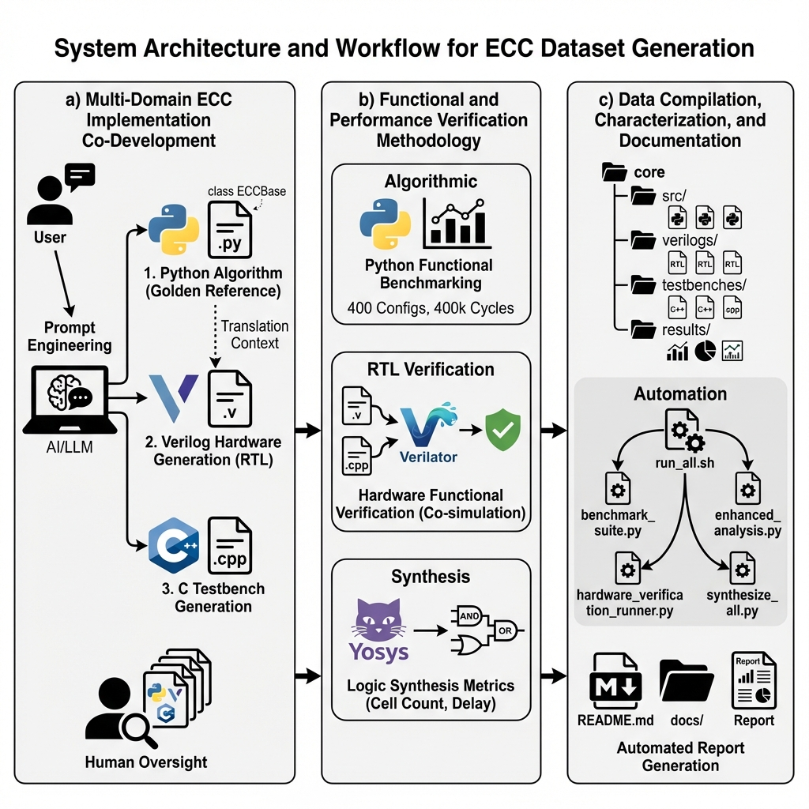

# Collection Methods and Design - CORE-CC Dataset

## Draft for IEEE Data Descriptor Paper

---

Building upon the foundation of the CORE (Corpus Of RTL designs for EDA Research) project, the CORE-CC dataset represents a specialized evolution focused on the digital coding domain. By leveraging Large Language Models (LLMs) to process and extend the original CORE framework, we established a systematic methodology that prioritizes algorithmic correctness before hardware realization. To ensure rigorous algorithmic fidelity, our methodology prioritizes an "algorithm-first" strategy, establishing a verified executable specification before any hardware description is generated.

This methodology begins with the implementation of high-level Python algorithms for each Error-Correcting Code (ECC), a strategic choice that serves three critical purposes. First, the Python implementation acts as a **Golden Reference**, providing an executable specification and an absolute source of truth that ensures complex mathematical properties are correctly defined before translation to hardware. Second, it enables **Algorithmic Verification**, allowing for rapid prototyping and rigorous validation of error correction logic—such as polynomial arithmetic in BCH or Reed-Solomon—without the overhead of hardware simulation. Finally, it facilitates **Systematic Translation** by establishing a verified algorithmic baseline, enabling a less error-prone transformation into synthesizable Verilog modules that faithfully implement the intended theoretical behavior.

This systematic translation forms the backbone of our integrated workflow, depicted in . To ensure the integrity of this process, we structured the data collection and design into three key phases: a) Multi-Domain ECC Implementation Co-Development, b) Functional and Performance Verification Methodology, and c) Data Compilation, Characterization, and Documentation.

---

### a) Multi-Domain ECC Implementation Co-Development
 
The foundation of the dataset lies in a systematic approach to co-developing error correction code implementations across three complementary domains. This phase began with the definition of clear specifications for each ECC algorithm, detailing its mathematical foundation, encoding/decoding procedures, error correction capabilities, and configurability parameters (word length, code rate, error correction strength). To ensure consistency and correctness across these domains, the development process utilized a Large Language Model (LLM) to systematically generate implementations through a "specification-driven" methodology.
 
**1. Python Algorithm Generation (Golden Reference):**
The first stage leveraged the LLM to generate Python implementations derived from the `ECCBase` abstract base class. This enforces a standardized interface (`encode`, `decode`, `inject_error`) for uniform benchmarking and consistent error reporting across all 25 ECC types. By prioritizing Python, we leveraged the LLM's capability in algorithmic logic generation to establish a verified "Golden Reference". These implementations define the precise mathematical behavior, such as polynomial division for CRC or matrix multiplication for Hamming codes, for hardware replication. Configuration parameters within these classes enable flexibility across word lengths (4, 8, 16, 32 bits) and code-specific settings such as error correction capability and redundancy levels.
 
**2. Verilog Hardware Generation (RTL):**
Using the verified Python code as a context-rich prompt, the LLM was tasked with generating the corresponding Verilog RTL. This "translation" approach differs from direct RTL generation by providing the model with a concrete, functional reference to emulate. The resulting 39 Verilog modules (located in `verilogs/`) are designed for synthesizability and follow industry-standard coding practices to ensure portability across FPGA and ASIC flows. These implementations incorporate encoder modules, utilizing combinational or sequential logic based on complexity, and decoder modules with syndrome calculation and error correction logic. They feature configurable parameters for different word lengths and code rates, along with status outputs for error detection and correction, matching the Python algorithmic behavior while optimizing for hardware efficiency.
 
**3. C Testbench Generation (Verification):**
To close the verification loop, C++ testbenches were generated for the Verilator framework. These testbenches are designed to interface with the Verilog modules and rigorously check them against the expected behavior defined by the Python algorithms. This tri-domain approach (Python for logic, Verilog for hardware, and C++ for verification) ensures that the final dataset is not just a collection of code, but a cohesive, cross-validated suite.

---

### b) Functional and Performance Verification Methodology

The verification and characterization of the dataset was based on three complementary methods: Python-based functional benchmarking for algorithmic validation, hardware functional verification using Verilator for RTL correctness, and logic synthesis using Yosys for hardware metrics extraction.

**Python Functional Benchmarking:**
The primary method for algorithmic validation involved **randomized functional benchmarking**. This process systematically tests each ECC implementation across a comprehensive configuration space encompassing all ECC types, word lengths (4, 8, 16, 32 bits), and error patterns (single, double, burst, random), with 1,000 trials per configuration. This yields 400 distinct test configurations and 400,000 total encoding-decoding cycles. For each configuration, performance metrics are captured including success rate, correction rate, detection rate, code rate, and redundancy overhead. Detailed timing analysis measures encoding, decoding, and total processing time with high precision.

**Hardware Functional Verification (Verilator [CITE]):**
To verify the correctness of the generated Verilog hardware, dynamic simulation was performed using Verilator. The verification process employs a co-simulation approach where each Verilog module is compiled alongside a corresponding C++ testbench. These testbenches incorporate Python-equivalent algorithmic logic to serve as a golden reference. The simulation executes comprehensive test vectors covering normal operation, single-bit errors, multi-bit errors, and edge cases, validating hardware outputs against the reference model. This rigorous cycle-accurate verification ensures that the hardware implementation faithfully reproduces the intended algorithmic behavior across all supported configurations.

**Logic Synthesis (Yosys):**
To evaluate hardware characteristics, logic synthesis was performed using Yosys. Each Verilog module undergoes a standardized synthesis flow including hierarchy elaboration, optimization, and technology mapping to a generic cell library. This process extracts key hardware metrics such as cell count (gate complexity), wire count (routing complexity), and logic depth (critical path length). These metrics provide a hardware-independent baseline for quantitatively comparing the resource requirements and efficiency of different ECC algorithms.

[FIGURE 2: Verification and Characterization Workflow - Show the three parallel verification paths: Python benchmarking, Verilator simulation, and Yosys synthesis, all feeding into the final dataset]

---

### c) Data Compilation, Characterization, and Documentation

The data and metrics generated throughout the previous phases were systematically compiled, structured, and documented to ensure usability, reproducibility, and accessibility.

**Categorization and Organization:**
The dataset is structured by domain to facilitate navigation. Python implementations reside in `src/`, providing the algorithmic reference. Verilog hardware modules are located in `verilogs/`, including parameterized variants. C++ testbenches are stored in `testbenches/`, corresponding one-to-one with the ECC types. All experimental data, including benchmark metrics, simulation logs, and synthesis reports, are systematically aggregated in the `results/` directory.

**Automated Execution and Reporting:**
The entire data collection and analysis pipeline is orchestrated by the `run_all.sh` shell script, which integrates execution with automated reporting. This script triggers `benchmark_suite.py` for functional benchmarking, followed by `enhanced_analysis.py` to generate statistical summaries and visualizations (heatmaps, trade-off plots). It also executes `hardware_verification_runner.py` to produce unified verification status reports and `synthesize_all.py` to compile hardware metrics (gate counts, area) from Yosys logs. This unified workflow ensures that all results—from algorithmic performance to hardware costs—are consistently generated and aggregated in the `results/` directory.

**Supporting Documentation:**
Comprehensive documentation supports the reproducibility and understanding of the dataset. Algorithm-specific guides in `docs/` detail mathematical foundations and implementation specifics, together with a dedicated hardware verification guide that explains the co-simulation methodology and testbench structure. The top-level README serves as the primary entry point, offering project overview, installation steps, and usage examples.

[FIGURE 3: Data Organization Structure - Directory tree showing src/, verilogs/, testbenches/, results/, and docs/ with key files and their relationships]

[TABLE I: ECC Implementation Summary - Columns: ECC Type, Python File, Verilog File(s), Testbench File, Error Correction Capability, Code Rate Range]

---

## References for Collection Methods Section

[CITE: Verilator tool - https://verilator.org]
[CITE: Yosys Open SYnthesis Suite - Wolf, C. (2012)]
[CITE: Python NumPy library]
[CITE: Python Pandas library]
[CITE: bchlib Python library for BCH codes]
[CITE: reedsolo library for Reed-Solomon codes]
[CITE: pyldpc library for LDPC codes]
[CITE: scikit-commpy for communication system algorithms]
[CITE: MLflow for experiment tracking]
[CITE: Any relevant ECC theory papers for algorithms implemented]

---

## Notes for Figure Placeholders

**FIGURE 1: System Architecture and Workflow**
This figure should illustrate the three main implementation domains: Python for algorithmic reference, Verilog for hardware realization, and C++ for verification testbenches. The data flow should depict the progression from specification through Python implementation, then Verilog hardware implementation, and finally C++ testbench development. Parallel verification paths should be shown including Python benchmarking for algorithmic validation, Verilator simulation for hardware correctness, and Yosys synthesis for hardware characterization. The outputs section should indicate benchmark results, verification reports, and synthesis reports. Arrows connecting the domains should emphasize the cross-validation relationships where each domain serves as a reference for the others.

**FIGURE 2: Verification and Characterization Workflow**
This figure should depict four parallel verification methods operating concurrently. The first path represents Python Benchmarking showing 1,000 trials across 400 configurations for statistical analysis. The second path illustrates Verilator Hardware Simulation covering all 25 ECC types with cycle-accurate functional verification. The third path demonstrates Enhanced Analysis including metrics extraction, statistical processing, and visualization generation. The fourth path shows Yosys Logic Synthesis extracting gate counts, area estimates, and timing characteristics. All four paths should converge to a final dataset with complete characterization across functional, performance, and hardware dimensions. Sample metrics should be indicated at each stage to show the type of data collected.

**FIGURE 3: Data Organization Structure**
This figure should present a directory tree visualization showing the hierarchical organization of the dataset. The src/ directory should show 25 Python ECC implementation files. The verilogs/ directory should display 39 Verilog hardware modules with annotations indicating parameterized variants. The testbenches/ directory should list 25 C++ testbench files corresponding to each ECC type. The results/ directory should indicate subdirectories for benchmark data, synthesis reports, and verification logs. The docs/ directory should show implementation guide files. File naming conventions should be illustrated with example filenames following the *\_ecc.py, *\_ecc.v, and *\_tb.cpp patterns. Key configuration files such as example\_config.json and execution scripts such as run\_all.sh should be highlighted to indicate entry points for using the dataset.

---

## Key Metrics and Statistics

The CORE-CC dataset encompasses substantial scale and diversity. The dataset includes 25 distinct ECC types covering basic, advanced, modern, composite, and specialized error correction algorithms. Implementation artifacts comprise 25 Python files providing algorithmic reference implementations, 39 Verilog hardware modules including parameterized variants for design space exploration, and 25 C++ testbench files for hardware verification. The benchmarking methodology evaluates 400 unique test configurations resulting from the Cartesian product of 25 ECC types, 4 word lengths, and 4 error patterns, with each configuration subjected to 1,000 independent trials for statistical significance, yielding a total of 400,000 encoding-decoding test executions. Testing coverage spans word lengths of 4, 8, 16, and 32 bits to capture scaling behavior, and error patterns including single-bit errors, double-bit errors, burst errors with 3 consecutive bit flips, and random errors with 10\% bit flip probability. Hardware verification and characterization employ Verilator for cycle-accurate simulation and functional verification, and Yosys for logic synthesis and hardware metrics extraction. The software implementation leverages 11 Python package dependencies including numpy for numerical computation, pandas for data analysis, bchlib for BCH code algorithms, reedsolo for Reed-Solomon implementations, pyldpc for LDPC codes, scikit-commpy for communication system algorithms, pytest for automated testing, mlflow for experiment tracking, matplotlib and seaborn for visualization, and psutil for system resource monitoring.

---

*End of Draft*

