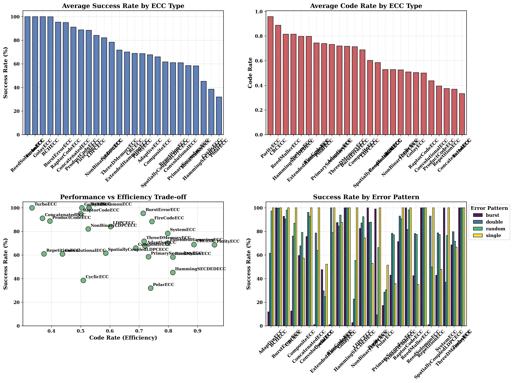
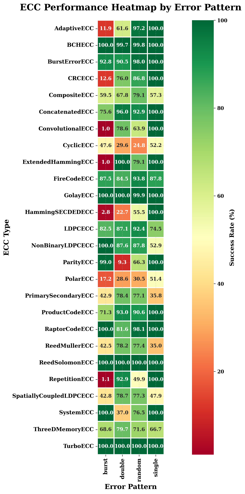
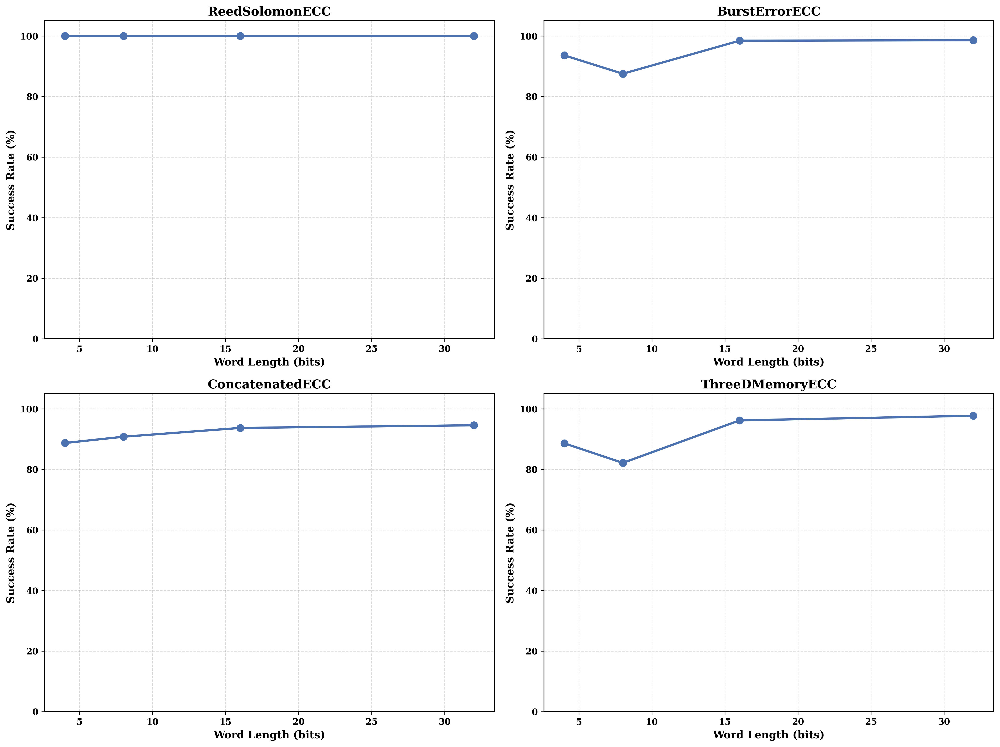
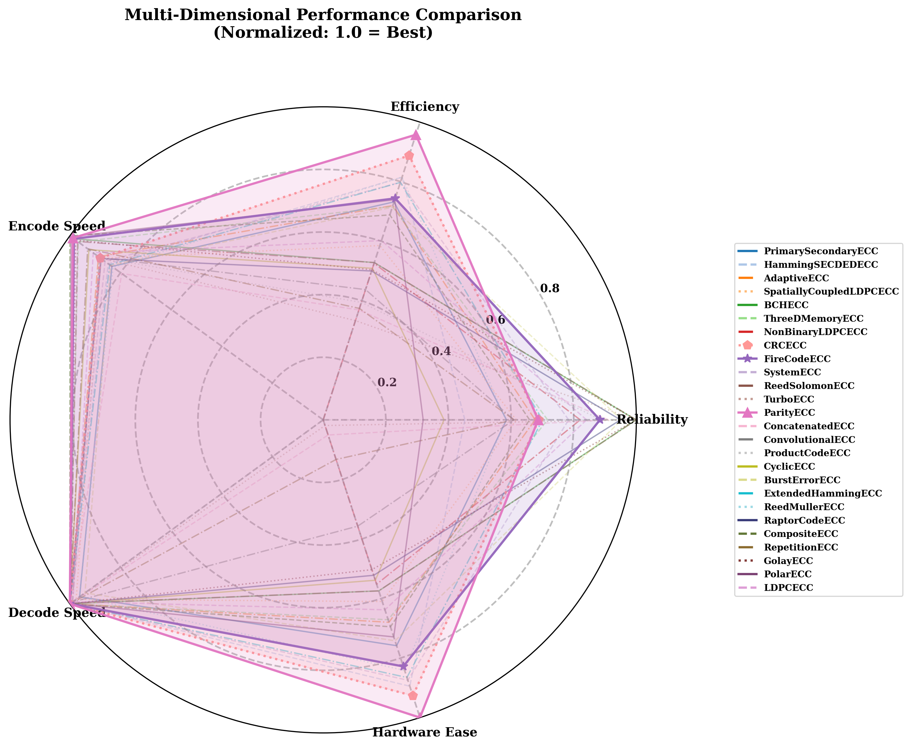
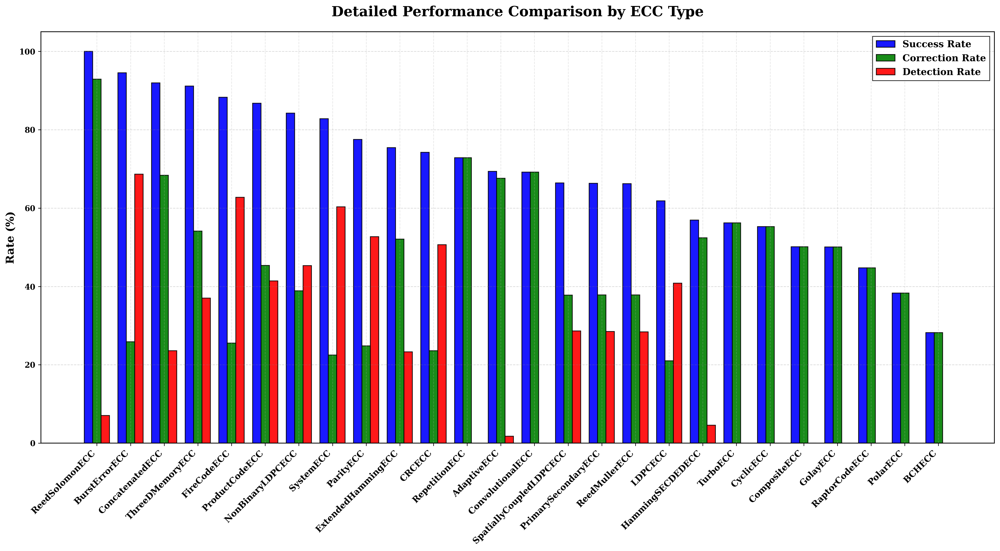
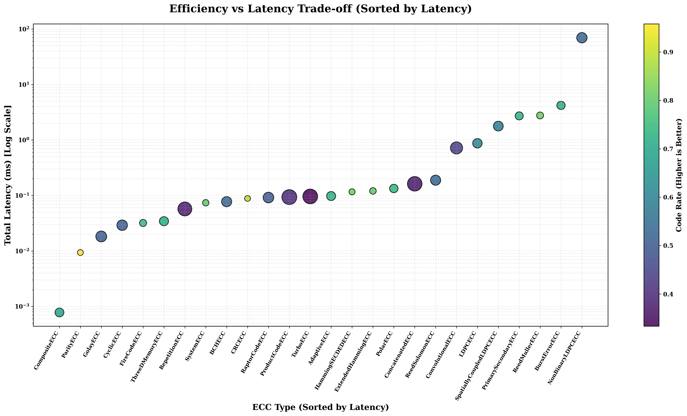
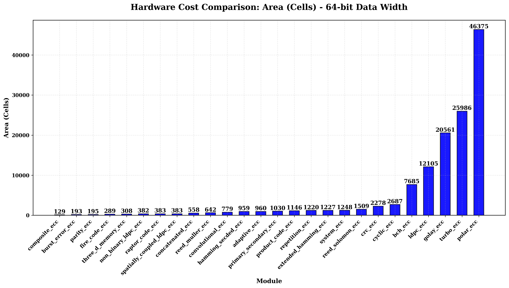
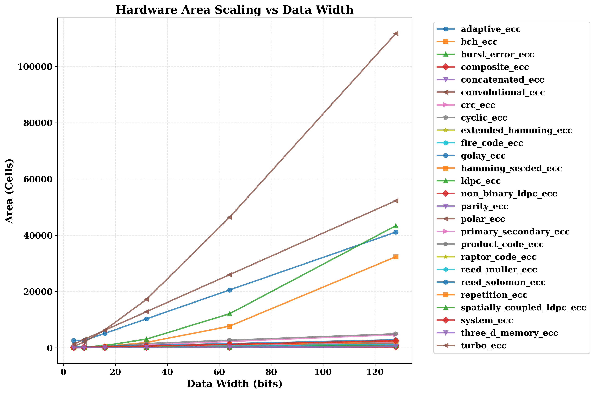

# ECC (Error Correction Code) Analysis Report

**Generated:** 2026-02-22 19:42:55  
**Framework Version:** 3.0  
**Analysis Scope:** Comprehensive analysis of 26 ECC types: PrimarySecondaryECC, HammingSECDEDECC, AdaptiveECC, SpatiallyCoupledLDPCECC, BCHECC, ThreeDMemoryECC, NonBinaryLDPCECC, CRCECC, FireCodeECC, SystemECC, ReedSolomonECC, TurboECC, ParityECC, ConcatenatedECC, ConvolutionalECC, ProductCodeECC, CyclicECC, BurstErrorECC, ExtendedHammingECC, ReedMullerECC, RaptorCodeECC, CompositeECC, RepetitionECC, GolayECC, PolarECC, LDPCECC

## Executive Summary

This report provides a comprehensive analysis of different Error Correction Code (ECC) implementations, comparing their performance characteristics, hardware costs, and suitability for various applications. The analysis is based on extensive benchmarking across multiple ECC types, word lengths, and error patterns.

## Performance Charts

*Comprehensive performance analysis showing success rates, code rates, and error pattern performance.*

*Performance heatmap showing success rates across different ECC types and error patterns.*

*Performance trends showing how ECC performance varies with word length (Top 5 performers highlighted).*

## Overall Verification Summary

| Metric | Value |
|--------|-------|
| Total ECC types analyzed | 26 |
| Algorithmic Data Widths | 4, 8, 16, 32, 64, 128 bits |
| Algorithmic Total trials | 624000 |
| Algorithmic Total runtime (s) | 2019.94 |
| | |
| Hardware Modules Passed | 26 / 26 |
| Hardware Verification Pass Rate | 100.0% |
| Hardware Data Widths | 4, 8, 16, 32, 64, 128 bits |
| Hardware Total test vectors | 156 |
| Hardware Total runtime (s) | 1056.30 |
| - Verilator (Functional) | 1.00 |
| - Yosys (Synthesis) | 1055.30 |
| Average runtime per module (s) | 40.63 |

## Performance Comparison

*Radar chart comparing all ECC types across normalized metrics. Top 3 ECC types overall are highlighted with thicker lines. Scale is 0-1, where 1 indicates the best performance in that metric (e.g., lowest latency, lowest overhead, highest reliability).*

**Normalized Metrics Definition (1.0 = Best):**
- **Reliability**: Average Success Rate (already 0-1).
- **Efficiency**: Average Code Rate (already 0-1).
- **Encode Speed**: Normalized Average Encode Time (inverted so lower time = closer to 1).
- **Decode Speed**: Normalized Average Decode Time (inverted so lower time = closer to 1).
- **Hardware Ease**: Normalized Average Overhead Ratio (inverted so lower overhead = closer to 1).

*Detailed comparison of success, correction, and detection rates across all ECC types.*

*Trade-off between Code Rate (Efficiency) and Total Latency (Speed). Top-left is better (High Efficiency, Low Latency).*

> **Note:** The values below are **averaged** across all simulated configuration pairs (Word Lengths: 4, 8, 16, 32, 64, 128 and Error Patterns: Single, Double, Burst, Random).
> **Metric Definitions:**
> - **Success Rate**: % of trials where output matches original data (Corrected + Detected).
> - **Correction Rate**: % of trials where errors were successfully fixed.
> - **Detection Rate**: % of trials where errors were detected but **NOT** corrected (i.e. uncorrectable errors caught by the ECC).

| ECC Type | Success Rate (%) | Correction Rate (%) | Detection Rate (%) | Code Rate | Overhead Ratio | Encode Time (ms) | Decode Time (ms) |
|----------|------------------|-------------------|-------------------|-----------|----------------|------------------|------------------|
| PrimarySecondaryECC | 0.6 | 0.2 | 0.4 | 0.732 | 0.530 | 0.062974 | 2.655884 |
| HammingSECDEDECC | 0.5 | 0.4 | 0.1 | 0.815 | 0.259 | 0.057592 | 0.058739 |
| AdaptiveECC | 0.7 | 0.5 | 0.2 | 0.720 | 0.686 | 0.042892 | 0.054652 |
| SpatiallyCoupledLDPCECC | 0.6 | 0.2 | 0.4 | 0.586 | 0.825 | 0.046592 | 1.730265 |
| BCHECC | 1.0 | 0.8 | 0.2 | 0.528 | 0.896 | 0.006171 | 0.071062 |
| ThreeDMemoryECC | 0.7 | 0.3 | 0.4 | 0.717 | 0.703 | 0.012812 | 0.021506 |
| NonBinaryLDPCECC | 0.8 | 0.2 | 0.6 | 0.526 | 0.940 | 0.377750 | 69.215699 |
| CRCECC | 0.7 | 0.1 | 0.6 | 0.888 | 0.196 | 0.045644 | 0.042609 |
| FireCodeECC | 0.9 | 0.1 | 0.8 | 0.744 | 0.391 | 0.006332 | 0.025563 |
| SystemECC | 0.8 | 0.1 | 0.7 | 0.798 | 0.299 | 0.052745 | 0.021089 |
| ReedSolomonECC | 1.0 | 0.7 | 0.3 | 0.528 | 0.896 | 0.011920 | 0.176379 |
| TurboECC | 1.0 | 0.2 | 0.8 | 0.333 | 2.000 | 0.045960 | 0.049953 |
| ParityECC | 0.7 | 0.1 | 0.6 | 0.958 | 0.050 | 0.004711 | 0.004648 |
| ConcatenatedECC | 0.9 | 0.5 | 0.4 | 0.369 | 1.937 | 0.077522 | 0.084498 |
| ConvolutionalECC | 0.6 | 0.6 | 0.0 | 0.438 | 1.328 | 0.044760 | 0.674397 |
| ProductCodeECC | 0.9 | 0.2 | 0.7 | 0.395 | 2.038 | 0.044693 | 0.048636 |
| CyclicECC | 0.4 | 0.4 | 0.0 | 0.509 | 0.967 | 0.028665 | 0.000406 |
| BurstErrorECC | 1.0 | 0.1 | 0.9 | 0.714 | 0.562 | 0.060963 | 4.139999 |
| ExtendedHammingECC | 0.7 | 0.3 | 0.4 | 0.798 | 0.318 | 0.059671 | 0.060839 |
| ReedMullerECC | 0.6 | 0.2 | 0.4 | 0.815 | 0.365 | 0.064740 | 2.699491 |
| RaptorCodeECC | 0.9 | 0.2 | 0.8 | 0.500 | 1.000 | 0.046946 | 0.044679 |
| CompositeECC | 0.7 | 0.2 | 0.5 | 0.688 | 0.656 | 0.000317 | 0.000462 |
| RepetitionECC | 0.6 | 0.6 | 0.0 | 0.374 | 1.773 | 0.026786 | 0.030282 |
| GolayECC | 1.0 | 1.0 | 0.0 | 0.504 | 1.038 | 0.008968 | 0.009261 |
| PolarECC | 0.3 | 0.3 | 0.0 | 0.739 | 0.589 | 0.002019 | 0.131366 |
| LDPCECC | 0.8 | 0.1 | 0.8 | 0.602 | 0.770 | 0.035164 | 0.836315 |

### Performance Metrics for 4-bit Data Width

| ECC Type | Code Params (N, K) | Success Rate (%) | Correction Rate (%) | Detection Rate (%) | Code Rate | Overhead Ratio | Total Time (ms) |
|----------|-------------------|------------------|-------------------|-------------------|-----------|----------------|-----------------|
| ReedSolomonECC | (5, 1) | 100.00 | 52.80 | 47.20 | 0.571 | 0.750 | 0.038903 |
| GolayECC | (23, 12) | 100.00 | 100.00 | 0.00 | 0.571 | 0.750 | 0.004153 |
| TurboECC | (12, 4) | 100.00 | 50.00 | 50.00 | 0.333 | 2.000 | 0.024021 |
| BCHECC | (7, 4) | 99.20 | 65.50 | 33.70 | 0.571 | 0.750 | 0.030555 |
| CompositeECC | (12, 4) | 98.83 | 26.38 | 72.45 | 0.333 | 2.000 | 0.000638 |
| RaptorCodeECC | (8, 4) | 97.40 | 28.62 | 68.77 | 0.500 | 1.000 | 0.018535 |
| BurstErrorECC | (8, 4) | 92.22 | 21.80 | 70.43 | 0.625 | 0.750 | 0.018807 |
| ConcatenatedECC | (24, 4) | 88.05 | 62.80 | 25.25 | 0.417 | 2.625 | 0.033010 |
| ThreeDMemoryECC | (15, 4) | 87.95 | 55.00 | 32.95 | 0.267 | 2.750 | 0.029686 |
| FireCodeECC | (16, 8) | 83.12 | 19.92 | 63.20 | 0.595 | 0.688 | 0.002291 |
| NonBinaryLDPCECC | (8, 4) | 82.67 | 40.28 | 42.40 | 0.518 | 0.938 | 0.011314 |
| CRCECC | (12, 4) | 80.58 | 19.48 | 61.10 | 0.722 | 0.625 | 0.011458 |
| ParityECC | (5, 4) | 80.22 | 24.78 | 55.45 | 0.850 | 0.188 | 0.001397 |
| ProductCodeECC | (21, 8) | 79.65 | 52.90 | 26.75 | 0.157 | 5.375 | 0.015865 |
| SystemECC | (8, 4) | 77.90 | 15.95 | 61.95 | 0.593 | 0.750 | 0.005367 |
| ExtendedHammingECC | (8, 4) | 75.92 | 52.80 | 23.12 | 0.518 | 0.938 | 0.009673 |
| PrimarySecondaryECC | (8, 4) | 70.70 | 44.45 | 26.25 | 0.750 | 0.500 | 0.014347 |
| ReedMullerECC | (8, 4) | 70.50 | 44.53 | 25.97 | 0.768 | 0.438 | 0.012135 |
| SpatiallyCoupledLDPCECC | (8, 4) | 69.25 | 43.90 | 25.35 | 0.625 | 0.750 | 0.047675 |
| RepetitionECC | (12, 4) | 68.77 | 68.77 | 0.00 | 0.333 | 2.000 | 0.006045 |
| ConvolutionalECC | (12, 4) | 63.27 | 63.27 | 0.00 | 0.333 | 2.000 | 0.087177 |
| PolarECC | (8, 4) | 55.95 | 55.95 | 0.00 | 0.369 | 1.750 | 0.091100 |
| CyclicECC | (14, 7) | 54.83 | 54.83 | 0.00 | 0.518 | 0.938 | 0.002152 |
| AdaptiveECC | (7, 4) | 54.57 | 54.57 | 0.00 | 0.786 | 0.375 | 0.009359 |
| HammingSECDEDECC | (7, 4) | 54.33 | 54.33 | 0.00 | 0.629 | 0.625 | 0.006536 |
| LDPCECC | (8, 4) | 28.02 | 28.02 | 0.00 | 1.000 | 0.000 | 0.021487 |

### Performance Metrics for 8-bit Data Width

| ECC Type | Code Params (N, K) | Success Rate (%) | Correction Rate (%) | Detection Rate (%) | Code Rate | Overhead Ratio | Total Time (ms) |
|----------|-------------------|------------------|-------------------|-------------------|-----------|----------------|-----------------|
| TurboECC | (24, 8) | 100.00 | 0.00 | 100.00 | 0.333 | 2.000 | 0.031589 |
| GolayECC | (23, 12) | 100.00 | 100.00 | 0.00 | 0.348 | 1.875 | 0.004751 |
| BCHECC | (15, 7) | 100.00 | 85.60 | 14.40 | 0.533 | 0.875 | 0.059795 |
| ReedSolomonECC | (5, 1) | 100.00 | 75.35 | 24.65 | 0.533 | 0.875 | 0.096376 |
| CompositeECC | (16, 8) | 98.45 | 23.00 | 75.45 | 0.500 | 1.000 | 0.000759 |
| RaptorCodeECC | (16, 8) | 95.92 | 24.65 | 71.28 | 0.500 | 1.000 | 0.023694 |
| LDPCECC | (16, 8) | 94.38 | 25.78 | 68.60 | 0.550 | 0.844 | 0.420150 |
| ConcatenatedECC | (24, 8) | 87.22 | 52.98 | 34.25 | 0.413 | 1.438 | 0.033098 |
| BurstErrorECC | (16, 8) | 86.67 | 21.30 | 65.38 | 0.643 | 0.688 | 0.098190 |
| NonBinaryLDPCECC | (16, 8) | 83.00 | 28.40 | 54.60 | 0.500 | 1.000 | 0.100567 |
| ProductCodeECC | (35, 16) | 81.55 | 39.68 | 41.88 | 0.294 | 2.406 | 0.025039 |
| FireCodeECC | (24, 8) | 81.25 | 17.38 | 63.88 | 0.593 | 0.688 | 0.006698 |
| ThreeDMemoryECC | (15, 8) | 80.22 | 43.65 | 36.58 | 0.634 | 0.594 | 0.029268 |
| AdaptiveECC | (12, 8) | 80.17 | 62.88 | 17.30 | 0.453 | 2.125 | 0.039795 |
| SystemECC | (13, 8) | 77.55 | 10.10 | 67.45 | 0.700 | 0.438 | 0.010992 |
| ParityECC | (9, 8) | 74.20 | 13.67 | 60.52 | 0.944 | 0.062 | 0.002415 |
| CRCECC | (16, 8) | 74.10 | 11.20 | 62.90 | 0.808 | 0.312 | 0.019530 |
| ExtendedHammingECC | (13, 8) | 73.02 | 43.35 | 29.68 | 0.752 | 0.375 | 0.018727 |
| RepetitionECC | (24, 8) | 68.20 | 68.20 | 0.00 | 0.528 | 1.062 | 0.009482 |
| PrimarySecondaryECC | (16, 8) | 64.22 | 26.95 | 37.28 | 0.633 | 0.719 | 0.077550 |
| ReedMullerECC | (16, 8) | 64.22 | 27.27 | 36.95 | 0.750 | 0.500 | 0.071520 |
| SpatiallyCoupledLDPCECC | (16, 8) | 63.05 | 25.25 | 37.80 | 0.633 | 0.719 | 0.099187 |
| ConvolutionalECC | (20, 8) | 61.60 | 61.60 | 0.00 | 0.400 | 1.500 | 0.145089 |
| HammingSECDEDECC | (12, 8) | 52.97 | 45.35 | 7.62 | 0.753 | 0.344 | 0.013243 |
| CyclicECC | (8, 7) | 46.08 | 46.08 | 0.00 | 0.508 | 0.969 | 0.004590 |
| PolarECC | (16, 8) | 31.48 | 31.48 | 0.00 | 0.560 | 0.812 | 0.095841 |

### Performance Metrics for 16-bit Data Width

| ECC Type | Code Params (N, K) | Success Rate (%) | Correction Rate (%) | Detection Rate (%) | Code Rate | Overhead Ratio | Total Time (ms) |
|----------|-------------------|------------------|-------------------|-------------------|-----------|----------------|-----------------|
| BCHECC | (31, 16) | 100.00 | 85.10 | 14.90 | 0.516 | 0.938 | 0.097679 |
| ReedSolomonECC | (6, 2) | 100.00 | 75.12 | 24.88 | 0.516 | 0.938 | 0.258900 |
| TurboECC | (48, 16) | 100.00 | 25.00 | 75.00 | 0.333 | 2.000 | 0.047611 |
| GolayECC | (46, 24) | 100.00 | 100.00 | 0.00 | 0.533 | 0.875 | 0.008716 |
| BurstErrorECC | (32, 16) | 97.80 | 2.05 | 95.75 | 0.508 | 0.969 | 0.898797 |
| RaptorCodeECC | (32, 16) | 95.52 | 19.85 | 75.67 | 0.500 | 1.000 | 0.035722 |
| ThreeDMemoryECC | (25, 16) | 92.70 | 34.88 | 57.83 | 0.653 | 0.531 | 0.035751 |
| LDPCECC | (32, 16) | 90.53 | 0.03 | 90.50 | 0.504 | 0.984 | 0.554354 |
| ConcatenatedECC | (48, 16) | 89.65 | 52.08 | 37.58 | 0.356 | 1.812 | 0.059887 |
| FireCodeECC | (40, 8) | 89.58 | 3.33 | 86.25 | 0.667 | 0.500 | 0.012222 |
| NonBinaryLDPCECC | (32, 16) | 81.17 | 16.95 | 64.22 | 0.508 | 0.969 | 0.769714 |
| CompositeECC | (24, 16) | 80.88 | 20.78 | 60.10 | 0.667 | 0.500 | 0.000618 |
| ProductCodeECC | (108, 64) | 80.17 | 26.57 | 53.60 | 0.402 | 1.500 | 0.040404 |
| SystemECC | (22, 16) | 77.30 | 3.98 | 73.32 | 0.783 | 0.281 | 0.019440 |
| ExtendedHammingECC | (22, 16) | 69.80 | 34.65 | 35.15 | 0.814 | 0.250 | 0.031044 |
| AdaptiveECC | (21, 16) | 69.40 | 48.55 | 20.85 | 0.723 | 0.609 | 0.045462 |
| CRCECC | (24, 16) | 68.27 | 4.83 | 63.45 | 0.926 | 0.094 | 0.031323 |
| ParityECC | (17, 16) | 68.03 | 6.73 | 61.30 | 0.985 | 0.016 | 0.003557 |
| RepetitionECC | (48, 16) | 64.72 | 64.72 | 0.00 | 0.356 | 1.812 | 0.019461 |
| ConvolutionalECC | (36, 16) | 60.60 | 60.60 | 0.00 | 0.444 | 1.250 | 0.286490 |
| PrimarySecondaryECC | (32, 16) | 59.62 | 15.10 | 44.53 | 0.508 | 0.969 | 0.609678 |
| ReedMullerECC | (32, 16) | 59.55 | 15.12 | 44.43 | 0.750 | 0.500 | 0.624788 |
| SpatiallyCoupledLDPCECC | (32, 16) | 58.52 | 15.35 | 43.17 | 0.504 | 0.984 | 0.210390 |
| HammingSECDEDECC | (21, 16) | 46.35 | 35.98 | 10.38 | 0.781 | 0.281 | 0.032658 |
| CyclicECC | (16, 7) | 37.45 | 37.45 | 0.00 | 0.508 | 0.969 | 0.007759 |
| PolarECC | (32, 16) | 25.92 | 25.92 | 0.00 | 0.508 | 0.969 | 0.144702 |

### Performance Metrics for 32-bit Data Width

| ECC Type | Code Params (N, K) | Success Rate (%) | Correction Rate (%) | Detection Rate (%) | Code Rate | Overhead Ratio | Total Time (ms) |
|----------|-------------------|------------------|-------------------|-------------------|-----------|----------------|-----------------|
| ReedSolomonECC | (8, 4) | 100.00 | 75.12 | 24.88 | 0.516 | 0.938 | 0.249820 |
| BCHECC | (63, 32) | 100.00 | 84.58 | 15.43 | 0.516 | 0.938 | 0.100668 |
| TurboECC | (96, 32) | 100.00 | 25.00 | 75.00 | 0.333 | 2.000 | 0.078679 |
| GolayECC | (92, 48) | 100.00 | 100.00 | 0.00 | 0.525 | 0.906 | 0.014724 |
| BurstErrorECC | (64, 32) | 98.78 | 0.33 | 98.45 | 0.508 | 0.969 | 8.284819 |
| LDPCECC | (64, 32) | 96.98 | 0.03 | 96.95 | 0.532 | 0.883 | 0.695322 |
| ThreeDMemoryECC | (45, 32) | 96.50 | 27.45 | 69.05 | 0.747 | 0.344 | 0.050854 |
| RaptorCodeECC | (64, 32) | 94.47 | 14.13 | 80.35 | 0.500 | 1.000 | 0.066246 |
| ProductCodeECC | (357, 256) | 92.85 | 13.97 | 78.88 | 0.489 | 1.047 | 0.070380 |
| FireCodeECC | (72, 8) | 92.03 | 1.28 | 90.75 | 0.781 | 0.281 | 0.032459 |
| ConcatenatedECC | (96, 32) | 91.65 | 49.10 | 42.55 | 0.352 | 1.844 | 0.105498 |
| NonBinaryLDPCECC | (64, 32) | 81.30 | 12.28 | 69.03 | 0.627 | 0.742 | 7.069800 |
| SystemECC | (39, 32) | 78.48 | 1.05 | 77.43 | 0.860 | 0.164 | 0.049082 |
| AdaptiveECC | (38, 32) | 71.62 | 47.05 | 24.58 | 0.683 | 0.578 | 0.078941 |
| ExtendedHammingECC | (39, 32) | 67.33 | 27.95 | 39.38 | 0.832 | 0.203 | 0.074090 |
| CRCECC | (40, 32) | 64.48 | 1.18 | 63.30 | 0.917 | 0.094 | 0.069657 |
| ParityECC | (33, 32) | 64.03 | 1.85 | 62.18 | 0.985 | 0.016 | 0.005965 |
| SpatiallyCoupledLDPCECC | (64, 32) | 60.15 | 11.15 | 49.00 | 0.625 | 0.750 | 0.586705 |
| PrimarySecondaryECC | (64, 32) | 60.13 | 11.38 | 48.75 | 0.502 | 0.992 | 5.201094 |
| ConvolutionalECC | (68, 32) | 59.70 | 59.70 | 0.00 | 0.471 | 1.125 | 0.566693 |
| RepetitionECC | (96, 32) | 59.42 | 59.42 | 0.00 | 0.345 | 1.906 | 0.043962 |
| ReedMullerECC | (64, 32) | 58.53 | 10.80 | 47.73 | 0.625 | 0.750 | 5.202671 |
| CompositeECC | (40, 32) | 58.50 | 16.85 | 41.65 | 0.800 | 0.250 | 0.000898 |
| HammingSECDEDECC | (38, 32) | 41.80 | 27.82 | 13.97 | 0.848 | 0.180 | 0.077349 |
| CyclicECC | (32, 7) | 33.15 | 33.15 | 0.00 | 0.506 | 0.977 | 0.021774 |
| PolarECC | (64, 32) | 26.00 | 26.00 | 0.00 | 1.000 | 0.000 | 0.152104 |

### Performance Metrics for 64-bit Data Width

| ECC Type | Code Params (N, K) | Success Rate (%) | Correction Rate (%) | Detection Rate (%) | Code Rate | Overhead Ratio | Total Time (ms) |
|----------|-------------------|------------------|-------------------|-------------------|-----------|----------------|-----------------|
| BCHECC | (127, 64) | 100.00 | 84.70 | 15.30 | 0.516 | 0.938 | 0.090997 |
| TurboECC | (192, 64) | 100.00 | 0.00 | 100.00 | 0.333 | 2.000 | 0.143366 |
| ReedSolomonECC | (12, 8) | 100.00 | 75.10 | 24.90 | 0.516 | 0.938 | 0.239384 |
| GolayECC | (184, 96) | 99.98 | 99.98 | 0.00 | 0.525 | 0.906 | 0.027754 |
| ProductCodeECC | (357, 256) | 98.22 | 3.72 | 94.50 | 0.510 | 0.961 | 0.141910 |
| BurstErrorECC | (128, 64) | 98.12 | 0.00 | 98.12 | 1.000 | 0.000 | 8.236571 |
| LDPCECC | (128, 64) | 96.80 | 0.00 | 96.80 | 0.522 | 0.926 | 1.031769 |
| ConcatenatedECC | (192, 64) | 94.97 | 48.90 | 46.07 | 0.342 | 1.926 | 0.241511 |
| RaptorCodeECC | (128, 64) | 93.40 | 7.88 | 85.53 | 0.500 | 1.000 | 0.131976 |
| FireCodeECC | (136, 8) | 92.35 | 0.35 | 92.00 | 0.889 | 0.125 | 0.045585 |
| NonBinaryLDPCECC | (128, 64) | 81.67 | 11.50 | 70.17 | 0.501 | 0.996 | 52.294121 |
| SystemECC | (72, 64) | 78.55 | 0.38 | 78.17 | 0.908 | 0.102 | 0.112541 |
| ExtendedHammingECC | (72, 64) | 66.78 | 25.37 | 41.40 | 0.922 | 0.086 | 0.178701 |
| AdaptiveECC | (71, 64) | 66.55 | 40.47 | 26.07 | 0.793 | 0.289 | 0.118144 |
| CRCECC | (72, 64) | 63.20 | 0.35 | 62.85 | 0.960 | 0.043 | 0.132135 |
| ParityECC | (65, 64) | 62.78 | 0.45 | 62.32 | 0.988 | 0.012 | 0.012052 |
| ConvolutionalECC | (132, 64) | 60.52 | 60.52 | 0.00 | 0.485 | 1.062 | 1.124774 |
| SpatiallyCoupledLDPCECC | (128, 64) | 59.05 | 10.05 | 49.00 | 0.501 | 0.996 | 1.791430 |
| RepetitionECC | (192, 64) | 54.20 | 54.20 | 0.00 | 0.349 | 1.871 | 0.080220 |
| PrimarySecondaryECC | (128, 64) | 48.48 | 0.00 | 48.48 | 1.000 | 0.000 | 5.287667 |
| ReedMullerECC | (128, 64) | 48.27 | 0.00 | 48.27 | 1.000 | 0.000 | 5.427721 |
| HammingSECDEDECC | (71, 64) | 38.00 | 25.47 | 12.53 | 0.938 | 0.066 | 0.177024 |
| CompositeECC | (72, 64) | 38.00 | 12.68 | 25.32 | 0.889 | 0.125 | 0.000921 |
| ThreeDMemoryECC | (85, 64) | 35.27 | 0.00 | 35.27 | 1.000 | 0.000 | 0.029678 |
| CyclicECC | (64, 7) | 30.95 | 30.95 | 0.00 | 0.510 | 0.961 | 0.046533 |
| PolarECC | (128, 64) | 26.97 | 26.97 | 0.00 | 1.000 | 0.000 | 0.152704 |

### Performance Metrics for 128-bit Data Width

| ECC Type | Code Params (N, K) | Success Rate (%) | Correction Rate (%) | Detection Rate (%) | Code Rate | Overhead Ratio | Total Time (ms) |
|----------|-------------------|------------------|-------------------|-------------------|-----------|----------------|-----------------|
| BCHECC | (255, 128) | 100.00 | 84.78 | 15.22 | 0.516 | 0.938 | 0.083700 |
| TurboECC | (384, 128) | 100.00 | 0.00 | 100.00 | 0.333 | 2.000 | 0.250212 |
| ReedSolomonECC | (20, 16) | 100.00 | 75.08 | 24.93 | 0.516 | 0.938 | 0.246409 |
| ProductCodeECC | (357, 256) | 99.95 | 0.25 | 99.70 | 0.516 | 0.938 | 0.266371 |
| GolayECC | (368, 192) | 99.90 | 99.90 | 0.00 | 0.522 | 0.914 | 0.049276 |
| BurstErrorECC | (256, 128) | 98.28 | 0.00 | 98.28 | 1.000 | 0.000 | 7.668591 |
| LDPCECC | (256, 128) | 97.95 | 0.00 | 97.95 | 0.505 | 0.980 | 2.505794 |
| ConcatenatedECC | (384, 128) | 95.25 | 49.45 | 45.80 | 0.336 | 1.977 | 0.499116 |
| RaptorCodeECC | (256, 128) | 92.92 | 2.95 | 89.97 | 0.500 | 1.000 | 0.273579 |
| FireCodeECC | (264, 8) | 91.85 | 0.15 | 91.70 | 0.938 | 0.066 | 0.092115 |
| NonBinaryLDPCECC | (256, 128) | 82.65 | 12.05 | 70.60 | 0.501 | 0.996 | 357.315178 |
| SystemECC | (137, 128) | 80.47 | 0.20 | 80.27 | 0.943 | 0.061 | 0.245580 |
| ExtendedHammingECC | (137, 128) | 67.38 | 25.17 | 42.20 | 0.948 | 0.055 | 0.410825 |
| AdaptiveECC | (136, 128) | 63.73 | 37.60 | 26.12 | 0.882 | 0.141 | 0.293564 |
| ParityECC | (129, 128) | 62.58 | 0.12 | 62.45 | 0.994 | 0.006 | 0.030767 |
| CRCECC | (136, 128) | 62.55 | 0.18 | 62.38 | 0.994 | 0.006 | 0.265420 |
| SpatiallyCoupledLDPCECC | (256, 128) | 59.95 | 10.00 | 49.95 | 0.625 | 0.750 | 7.925758 |
| ConvolutionalECC | (260, 128) | 59.67 | 59.67 | 0.00 | 0.492 | 1.031 | 2.104718 |
| RepetitionECC | (384, 128) | 50.45 | 50.45 | 0.00 | 0.335 | 1.988 | 0.183242 |
| ReedMullerECC | (256, 128) | 48.52 | 0.00 | 48.52 | 1.000 | 0.000 | 5.246552 |
| PrimarySecondaryECC | (256, 128) | 48.00 | 0.00 | 48.00 | 1.000 | 0.000 | 5.122809 |
| HammingSECDEDECC | (136, 128) | 37.95 | 25.12 | 12.83 | 0.943 | 0.061 | 0.391172 |
| ThreeDMemoryECC | (165, 128) | 37.23 | 0.00 | 37.23 | 1.000 | 0.000 | 0.030674 |
| CyclicECC | (128, 7) | 28.98 | 28.98 | 0.00 | 0.503 | 0.988 | 0.091621 |
| PolarECC | (256, 128) | 25.23 | 25.23 | 0.00 | 1.000 | 0.000 | 0.163855 |
| CompositeECC | (136, 128) | 20.82 | 5.75 | 15.07 | 0.941 | 0.062 | 0.000837 |

## Hardware Cost Comparison

*Relative hardware cost comparison of ECC modules (in Yosys internal cells, 64-bit data width).*

*Hardware area scaling with increasing data width.*

### Relative Cost (Normalized to minimum, 64-bit Data Width)

| Module | Area (Cells) | Relative Cost |
|--------|--------------|---------------|
| composite_ecc | 129 | 1.0x |
| burst_error_ecc | 193 | 1.5x |
| parity_ecc | 195 | 1.5x |
| fire_code_ecc | 289 | 2.2x |
| three_d_memory_ecc | 308 | 2.4x |
| non_binary_ldpc_ecc | 382 | 3.0x |
| raptor_code_ecc | 383 | 3.0x |
| spatially_coupled_ldpc_ecc | 383 | 3.0x |
| concatenated_ecc | 558 | 4.3x |
| reed_muller_ecc | 642 | 5.0x |
| convolutional_ecc | 779 | 6.0x |
| hamming_secded_ecc | 959 | 7.4x |
| adaptive_ecc | 960 | 7.4x |
| primary_secondary_ecc | 1030 | 8.0x |
| product_code_ecc | 1146 | 8.9x |
| repetition_ecc | 1220 | 9.5x |
| extended_hamming_ecc | 1227 | 9.5x |
| system_ecc | 1248 | 9.7x |
| reed_solomon_ecc | 1509 | 11.7x |
| crc_ecc | 2278 | 17.7x |
| cyclic_ecc | 2687 | 20.8x |
| bch_ecc | 7685 | 59.6x |
| ldpc_ecc | 12105 | 93.8x |
| golay_ecc | 20561 | 159.4x |
| turbo_ecc | 25986 | 201.4x |
| polar_ecc | 46375 | 359.5x |

## Hardware Verification Results

**Total Verification Time:** 1056.30s
**Average Runtime per Module:** 40.6000s

### Testbench Summary

| Testbench | Overall Status | Test Cases | Notes |
|-----------|----------------|------------|-------|
| burst_error_ecc_tb | PASS | hardware_verification_w16: PASS, hardware_verification_w32: PASS, hardware_verification_w4: PASS, hardware_verification_w8: PASS, hardware_verification_w64: PASS, hardware_verification_w128: PASS | Functional verification completed |
| adaptive_ecc_tb | PASS | hardware_verification_w8: PASS, hardware_verification_w32: PASS, hardware_verification_w16: PASS, hardware_verification_w4: PASS, hardware_verification_w128: PASS, hardware_verification_w64: PASS | Functional verification completed |
| bch_ecc_tb | PASS | hardware_verification_w4: PASS, hardware_verification_w16: PASS, hardware_verification_w64: PASS, hardware_verification_w32: PASS, hardware_verification_w128: PASS, hardware_verification_w8: PASS | Functional verification completed |
| composite_ecc_tb | PASS | hardware_verification_w8: PASS, hardware_verification_w4: PASS, hardware_verification_w16: PASS, hardware_verification_w128: PASS, hardware_verification_w64: PASS, hardware_verification_w32: PASS | Functional verification completed |
| concatenated_ecc_tb | PASS | hardware_verification_w16: PASS, hardware_verification_w8: PASS, hardware_verification_w32: PASS, hardware_verification_w4: PASS, hardware_verification_w64: PASS, hardware_verification_w128: PASS | Functional verification completed |
| convolutional_ecc_tb | PASS | hardware_verification_w8: PASS, hardware_verification_w16: PASS, hardware_verification_w64: PASS, hardware_verification_w128: PASS, hardware_verification_w4: PASS, hardware_verification_w32: PASS | Functional verification completed |
| crc_ecc_tb | PASS | hardware_verification_w4: PASS, hardware_verification_w32: PASS, hardware_verification_w16: PASS, hardware_verification_w8: PASS, hardware_verification_w128: PASS, hardware_verification_w64: PASS | Functional verification completed |
| cyclic_ecc_tb | PASS | hardware_verification_w4: PASS, hardware_verification_w8: PASS, hardware_verification_w128: PASS, hardware_verification_w32: PASS, hardware_verification_w16: PASS, hardware_verification_w64: PASS | Functional verification completed |
| extended_hamming_ecc_tb | PASS | hardware_verification_w16: PASS, hardware_verification_w8: PASS, hardware_verification_w32: PASS, hardware_verification_w4: PASS, hardware_verification_w64: PASS, hardware_verification_w128: PASS | Functional verification completed |
| fire_code_ecc_tb | PASS | hardware_verification_w4: PASS, hardware_verification_w8: PASS, hardware_verification_w16: PASS, hardware_verification_w32: PASS, hardware_verification_w128: PASS, hardware_verification_w64: PASS | Functional verification completed |
| golay_ecc_tb | PASS | hardware_verification_w4: PASS, hardware_verification_w16: PASS, hardware_verification_w8: PASS, hardware_verification_w64: PASS, hardware_verification_w32: PASS, hardware_verification_w128: PASS | Functional verification completed |
| hamming_secded_ecc_tb | PASS | hardware_verification_w8: PASS, hardware_verification_w16: PASS, hardware_verification_w4: PASS, hardware_verification_w32: PASS, hardware_verification_w128: PASS, hardware_verification_w64: PASS | Functional verification completed |
| ldpc_ecc_tb | PASS | hardware_verification_w4: PASS, hardware_verification_w64: PASS, hardware_verification_w8: PASS, hardware_verification_w16: PASS, hardware_verification_w32: PASS, hardware_verification_w128: PASS | Functional verification completed |
| non_binary_ldpc_ecc_tb | PASS | hardware_verification_w4: PASS, hardware_verification_w8: PASS, hardware_verification_w32: PASS, hardware_verification_w16: PASS, hardware_verification_w64: PASS, hardware_verification_w128: PASS | Functional verification completed |
| parity_ecc_tb | PASS | hardware_verification_w8: PASS, hardware_verification_w16: PASS, hardware_verification_w4: PASS, hardware_verification_w32: PASS, hardware_verification_w128: PASS, hardware_verification_w64: PASS | Functional verification completed |
| polar_ecc_tb | PASS | hardware_verification_w4: PASS, hardware_verification_w8: PASS, hardware_verification_w32: PASS, hardware_verification_w16: PASS, hardware_verification_w128: PASS, hardware_verification_w64: PASS | Functional verification completed |
| primary_secondary_ecc_tb | PASS | hardware_verification_w4: PASS, hardware_verification_w8: PASS, hardware_verification_w32: PASS, hardware_verification_w16: PASS, hardware_verification_w64: PASS, hardware_verification_w128: PASS | Functional verification completed |
| product_code_ecc_tb | PASS | hardware_verification_w8: PASS, hardware_verification_w4: PASS, hardware_verification_w64: PASS, hardware_verification_w16: PASS, hardware_verification_w128: PASS, hardware_verification_w32: PASS | Functional verification completed |
| raptor_code_ecc_tb | PASS | hardware_verification_w4: PASS, hardware_verification_w16: PASS, hardware_verification_w8: PASS, hardware_verification_w32: PASS, hardware_verification_w128: PASS, hardware_verification_w64: PASS | Functional verification completed |
| reed_muller_ecc_tb | PASS | hardware_verification_w8: PASS, hardware_verification_w4: PASS, hardware_verification_w16: PASS, hardware_verification_w64: PASS, hardware_verification_w32: PASS, hardware_verification_w128: PASS | Functional verification completed |
| reed_solomon_ecc_tb | PASS | hardware_verification_w8: PASS, hardware_verification_w4: PASS, hardware_verification_w32: PASS, hardware_verification_w128: PASS, hardware_verification_w16: PASS, hardware_verification_w64: PASS | Functional verification completed |
| repetition_ecc_tb | PASS | hardware_verification_w4: PASS, hardware_verification_w16: PASS, hardware_verification_w32: PASS, hardware_verification_w8: PASS, hardware_verification_w64: PASS, hardware_verification_w128: PASS | Functional verification completed |
| spatially_coupled_ldpc_ecc_tb | PASS | hardware_verification_w16: PASS, hardware_verification_w8: PASS, hardware_verification_w4: PASS, hardware_verification_w32: PASS, hardware_verification_w128: PASS, hardware_verification_w64: PASS | Functional verification completed |
| system_ecc_tb | PASS | hardware_verification_w4: PASS, hardware_verification_w16: PASS, hardware_verification_w32: PASS, hardware_verification_w8: PASS, hardware_verification_w64: PASS, hardware_verification_w128: PASS | Functional verification completed |
| three_d_memory_ecc_tb | PASS | hardware_verification_w4: PASS, hardware_verification_w8: PASS, hardware_verification_w16: PASS, hardware_verification_w32: PASS, hardware_verification_w64: PASS, hardware_verification_w128: PASS | Functional verification completed |
| turbo_ecc_tb | PASS | hardware_verification_w4: PASS, hardware_verification_w8: PASS, hardware_verification_w16: PASS, hardware_verification_w64: PASS, hardware_verification_w32: PASS, hardware_verification_w128: PASS | Functional verification completed |

## Detailed ECC Analysis

### Parity Bit ECC

**Characteristics:**
- **Error Detection:** Single-bit error detection only
- **Error Correction:** None
- **Redundancy:** 1 bit per data word
- **Hardware Cost:** Low (195 cells at 64-bit)
- **Latency:** Single cycle
- **Power Consumption:** Minimal

**Use Cases:**
- Simple error detection in non-critical systems
- Memory interfaces where correction is not required
- Cost-sensitive applications
- High-speed data transmission

### Hamming SECDED ECC

**Characteristics:**
- **Error Detection:** Double-bit error detection
- **Error Correction:** Single-bit error correction
- **Redundancy:** Logarithmic (e.g., 8 bits for 64-bit data)
- **Hardware Cost:** Medium (959 cells at 64-bit)
- **Latency:** Single cycle
- **Power Consumption:** Moderate

**Use Cases:**
- Server memory (ECC RAM)
- Critical systems requiring error correction
- High-reliability applications
- Storage systems

### Advanced ECC Types

**BCH (Bose-Chaudhuri-Hocquenghem) ECC:**
- **Error Correction:** Multi-bit error correction
- **Redundancy:** Configurable (typically 20-30%)
- **Hardware Cost:** High (7685 cells at 64-bit)
- **Use Cases:** Flash memory, SSDs, communication systems

**Reed-Solomon ECC:**
- **Error Correction:** Burst error correction
- **Redundancy:** Configurable (typically 10-50%)
- **Hardware Cost:** Medium (1509 cells at 64-bit)
- **Use Cases:** CDs, DVDs, QR codes, deep space communication

## Comparative Analysis by Data Width

> **Note on Synthesis Area:** Hardware area values (cell count) are measured by
> **Yosys logic synthesis** using technology-independent generic cells, with full
> sub-module flattening (`hierarchy + flatten`). Area naturally scales with data width.

### Data Width: 4 Bits

| ECC Module | Synthesis Area (Cells, Yosys) | Hardware Verification Status |
|------------|-------------------------------|------------------------------|
| adaptive_ecc | 54 | PASS |
| bch_ecc | 39 | PASS |
| burst_error_ecc | 13 | PASS |
| composite_ecc | 9 | PASS |
| concatenated_ecc | 33 | PASS |
| convolutional_ecc | 59 | PASS |
| crc_ecc | 64 | PASS |
| cyclic_ecc | 51 | PASS |
| extended_hamming_ecc | 77 | PASS |
| fire_code_ecc | 25 | PASS |
| golay_ecc | 2567 | PASS |
| hamming_secded_ecc | 54 | PASS |
| ldpc_ecc | 124 | PASS |
| non_binary_ldpc_ecc | 20 | PASS |
| parity_ecc | 15 | PASS |
| polar_ecc | 525 | PASS |
| primary_secondary_ecc | 54 | PASS |
| product_code_ecc | 88 | PASS |
| raptor_code_ecc | 23 | PASS |
| reed_muller_ecc | 42 | PASS |
| reed_solomon_ecc | 273 | PASS |
| repetition_ecc | 80 | PASS |
| spatially_coupled_ldpc_ecc | 23 | PASS |
| system_ecc | 91 | PASS |
| three_d_memory_ecc | 9 | PASS |
| turbo_ecc | 1332 | PASS |

### Data Width: 8 Bits

| ECC Module | Synthesis Area (Cells, Yosys) | Hardware Verification Status |
|------------|-------------------------------|------------------------------|
| adaptive_ecc | 115 | PASS |
| bch_ecc | 90 | PASS |
| burst_error_ecc | 25 | PASS |
| composite_ecc | 17 | PASS |
| concatenated_ecc | 68 | PASS |
| convolutional_ecc | 107 | PASS |
| crc_ecc | 205 | PASS |
| cyclic_ecc | 158 | PASS |
| extended_hamming_ecc | 153 | PASS |
| fire_code_ecc | 45 | PASS |
| golay_ecc | 2571 | PASS |
| hamming_secded_ecc | 115 | PASS |
| ldpc_ecc | 271 | PASS |
| non_binary_ldpc_ecc | 46 | PASS |
| parity_ecc | 27 | PASS |
| polar_ecc | 2022 | PASS |
| primary_secondary_ecc | 110 | PASS |
| product_code_ecc | 142 | PASS |
| raptor_code_ecc | 47 | PASS |
| reed_muller_ecc | 82 | PASS |
| reed_solomon_ecc | 358 | PASS |
| repetition_ecc | 156 | PASS |
| spatially_coupled_ldpc_ecc | 47 | PASS |
| system_ecc | 171 | PASS |
| three_d_memory_ecc | 42 | PASS |
| turbo_ecc | 2969 | PASS |

### Data Width: 16 Bits

| ECC Module | Synthesis Area (Cells, Yosys) | Hardware Verification Status |
|------------|-------------------------------|------------------------------|
| adaptive_ecc | 232 | PASS |
| bch_ecc | 522 | PASS |
| burst_error_ecc | 49 | PASS |
| composite_ecc | 33 | PASS |
| concatenated_ecc | 138 | PASS |
| convolutional_ecc | 203 | PASS |
| crc_ecc | 501 | PASS |
| cyclic_ecc | 447 | PASS |
| extended_hamming_ecc | 307 | PASS |
| fire_code_ecc | 91 | PASS |
| golay_ecc | 5141 | PASS |
| hamming_secded_ecc | 233 | PASS |
| ldpc_ecc | 822 | PASS |
| non_binary_ldpc_ecc | 94 | PASS |
| parity_ecc | 51 | PASS |
| polar_ecc | 6363 | PASS |
| primary_secondary_ecc | 230 | PASS |
| product_code_ecc | 288 | PASS |
| raptor_code_ecc | 95 | PASS |
| reed_muller_ecc | 162 | PASS |
| reed_solomon_ecc | 520 | PASS |
| repetition_ecc | 368 | PASS |
| spatially_coupled_ldpc_ecc | 95 | PASS |
| system_ecc | 324 | PASS |
| three_d_memory_ecc | 80 | PASS |
| turbo_ecc | 6256 | PASS |

### Data Width: 32 Bits

| ECC Module | Synthesis Area (Cells, Yosys) | Hardware Verification Status |
|------------|-------------------------------|------------------------------|
| adaptive_ecc | 473 | PASS |
| bch_ecc | 1897 | PASS |
| burst_error_ecc | 97 | PASS |
| composite_ecc | 65 | PASS |
| concatenated_ecc | 278 | PASS |
| convolutional_ecc | 395 | PASS |
| crc_ecc | 1094 | PASS |
| cyclic_ecc | 1536 | PASS |
| extended_hamming_ecc | 609 | PASS |
| fire_code_ecc | 161 | PASS |
| golay_ecc | 10281 | PASS |
| hamming_secded_ecc | 473 | PASS |
| ldpc_ecc | 3077 | PASS |
| non_binary_ldpc_ecc | 190 | PASS |
| parity_ecc | 99 | PASS |
| polar_ecc | 17206 | PASS |
| primary_secondary_ecc | 486 | PASS |
| product_code_ecc | 572 | PASS |
| raptor_code_ecc | 191 | PASS |
| reed_muller_ecc | 322 | PASS |
| reed_solomon_ecc | 845 | PASS |
| repetition_ecc | 612 | PASS |
| spatially_coupled_ldpc_ecc | 191 | PASS |
| system_ecc | 631 | PASS |
| three_d_memory_ecc | 156 | PASS |
| turbo_ecc | 12834 | PASS |

### Data Width: 64 Bits

| ECC Module | Synthesis Area (Cells, Yosys) | Hardware Verification Status |
|------------|-------------------------------|------------------------------|
| adaptive_ecc | 960 | PASS |
| bch_ecc | 7685 | PASS |
| burst_error_ecc | 193 | PASS |
| composite_ecc | 129 | PASS |
| concatenated_ecc | 558 | PASS |
| convolutional_ecc | 779 | PASS |
| crc_ecc | 2278 | PASS |
| cyclic_ecc | 2687 | PASS |
| extended_hamming_ecc | 1227 | PASS |
| fire_code_ecc | 289 | PASS |
| golay_ecc | 20561 | PASS |
| hamming_secded_ecc | 959 | PASS |
| ldpc_ecc | 12105 | PASS |
| non_binary_ldpc_ecc | 382 | PASS |
| parity_ecc | 195 | PASS |
| polar_ecc | 46375 | PASS |
| primary_secondary_ecc | 1030 | PASS |
| product_code_ecc | 1146 | PASS |
| raptor_code_ecc | 383 | PASS |
| reed_muller_ecc | 642 | PASS |
| reed_solomon_ecc | 1509 | PASS |
| repetition_ecc | 1220 | PASS |
| spatially_coupled_ldpc_ecc | 383 | PASS |
| system_ecc | 1248 | PASS |
| three_d_memory_ecc | 308 | PASS |
| turbo_ecc | 25986 | PASS |

### Data Width: 128 Bits

| ECC Module | Synthesis Area (Cells, Yosys) | Hardware Verification Status |
|------------|-------------------------------|------------------------------|
| adaptive_ecc | 1995 | PASS |
| bch_ecc | 32351 | PASS |
| burst_error_ecc | 385 | PASS |
| composite_ecc | 257 | PASS |
| concatenated_ecc | 1118 | PASS |
| convolutional_ecc | 1547 | PASS |
| crc_ecc | 4646 | PASS |
| cyclic_ecc | 4985 | PASS |
| extended_hamming_ecc | 2516 | PASS |
| fire_code_ecc | 545 | PASS |
| golay_ecc | 41121 | PASS |
| hamming_secded_ecc | 1996 | PASS |
| ldpc_ecc | 43390 | PASS |
| non_binary_ldpc_ecc | 766 | PASS |
| parity_ecc | 387 | PASS |
| polar_ecc | 111731 | PASS |
| primary_secondary_ecc | 2182 | PASS |
| product_code_ecc | 2294 | PASS |
| raptor_code_ecc | 767 | PASS |
| reed_muller_ecc | 1282 | PASS |
| reed_solomon_ecc | 2823 | PASS |
| repetition_ecc | 2436 | PASS |
| spatially_coupled_ldpc_ecc | 767 | PASS |
| system_ecc | 2544 | PASS |
| three_d_memory_ecc | 612 | PASS |
| turbo_ecc | 52288 | PASS |

## Key Findings

1. **Overall Best Performer:** BurstErrorECC ranks highest in composite performance score.

2. **Performance Range:** Success rates range from 31.9% to 100.0% across all ECC types.

3. **Efficiency Range:** Code rates range from 0.333 to 0.958 across all ECC types.

4. **Hardware Implementation:** Synthesis results available for hardware cost analysis.

5. **Functional Verification:** Testbench results available for functional validation.

## Recommendations

### Best ECC for Different Scenarios:

**High Reliability Systems:** ReedSolomonECC
**High Efficiency Applications:** FireCodeECC
**High Speed Applications:** GolayECC
**Single Bit Error Correction:** AdaptiveECC
**Double Bit Error Correction:** ExtendedHammingECC
**Burst Error Handling:** BCHECC
**Random Error Conditions:** ReedSolomonECC

### Detailed Recommendations:

1. **Overall Best Performer:** BurstErrorECC ranks highest in composite performance score.
2. **For High Reliability:** ReedSolomonECC provides the highest success rate across all scenarios.
3. **For High Efficiency:** FireCodeECC offers the best code rate (data efficiency).
4. **For High Speed:** GolayECC has the fastest encoding/decoding times.
5. **For Single Bit Errors:** AdaptiveECC provides the best correction rate for single bit errors.
6. **For Double Bit Errors:** ExtendedHammingECC handles double bit errors most effectively.
7. **For Burst Errors:** BCHECC handles burst errors most effectively.
8. **For Random Errors:** ReedSolomonECC performs best under random error conditions.

## Methodology

- **Benchmarking:** Comprehensive testing across multiple ECC types, word lengths, and error patterns
- **Analysis:** Statistical analysis and performance ranking of ECC schemes
- **Synthesis:** Yosys synthesis targeting generic technology library (when available)
- **Validation:** Verilator-based functional verification (when available)
- **Data Processing:** Automated analysis and visualization of results

## Future Work

- **Extended Benchmarking:** Additional ECC types and error patterns
- **Hardware Optimization:** Synthesis optimization techniques
- **Power Analysis:** Detailed power consumption measurements
- **Timing Analysis:** Critical path and performance analysis
- **Real-world Validation:** Testing with actual hardware platforms

## Conclusion

The choice of ECC depends on the specific requirements of the target application. This framework provides comprehensive benchmarking and analysis capabilities to help make informed decisions about ECC selection.

The enhanced analysis demonstrates the importance of considering multiple factors including performance, efficiency, and hardware cost when selecting ECC schemes for specific applications.

---
*Report generated by Enhanced ECC Analysis Framework v3.0*
