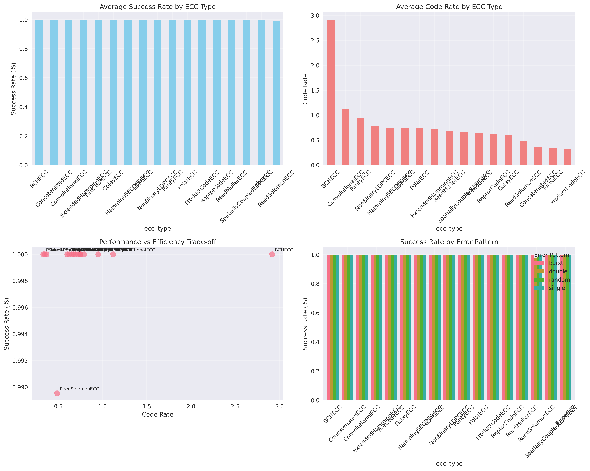
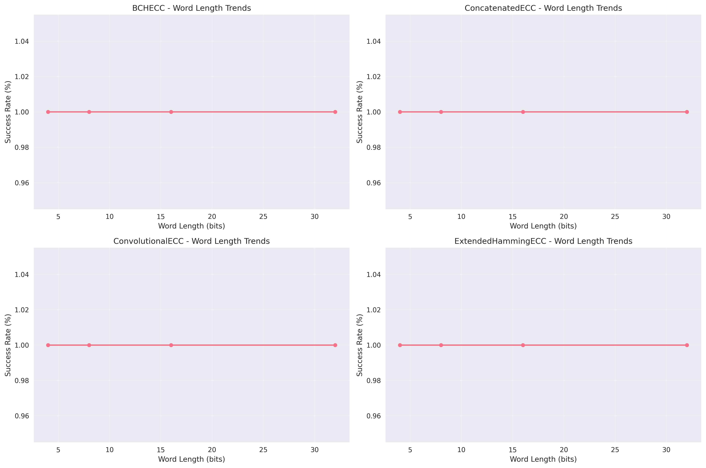

# ECC (Error Correction Code) Analysis Report

**Generated:** 2025-12-17 14:45:55  
**Framework Version:** 3.0  
**Analysis Scope:** Comprehensive analysis of 19 ECC types: SpatiallyCoupledLDPCECC, BCHECC, HammingSECDEDECC, NonBinaryLDPCECC, CRCECC, FireCodeECC, ReedSolomonECC, TurboECC, ParityECC, ConcatenatedECC, ConvolutionalECC, ReedMullerECC, ProductCodeECC, RepetitionECC, RaptorCodeECC, GolayECC, PolarECC, ExtendedHammingECC, LDPCECC

## Executive Summary

This report provides a comprehensive analysis of different Error Correction Code (ECC) implementations, comparing their performance characteristics, hardware costs, and suitability for various applications. The analysis is based on extensive benchmarking across multiple ECC types, word lengths, and error patterns.

## Performance Charts

*Comprehensive performance analysis showing success rates, code rates, and error pattern performance.*

*Performance heatmap showing success rates across different ECC types and error patterns.*

*Performance trends showing how ECC performance varies with word length.*

## Performance Comparison

*Detailed comparison of success, correction, and detection rates across all ECC types.*

*Trade-off between Code Rate (Efficiency) and Total Latency (Speed). Top-left is better (High Efficiency, Low Latency).*

| ECC Type | Success Rate (%) | Correction Rate (%) | Detection Rate (%) | Code Rate | Overhead Ratio | Encode Time (ms) | Decode Time (ms) |
|----------|------------------|-------------------|-------------------|-----------|----------------|------------------|------------------|
| SpatiallyCoupledLDPCECC | 0.7 | 0.4 | 0.3 | 0.660 | 0.672 | 0.015299 | 0.147850 |
| BCHECC | 0.3 | 0.3 | 0.0 | 0.534 | 0.875 | 0.000156 | 0.000219 |
| HammingSECDEDECC | 0.6 | 0.5 | 0.0 | 0.815 | 0.268 | 0.016300 | 0.016705 |
| NonBinaryLDPCECC | 0.8 | 0.4 | 0.5 | 0.573 | 0.836 | 0.033664 | 1.290733 |
| CRCECC | 0.7 | 0.2 | 0.5 | 0.802 | 0.332 | 0.015974 | 0.015623 |
| FireCodeECC | 0.9 | 0.3 | 0.6 | 0.649 | 0.580 | 0.002115 | 0.009395 |
| ReedSolomonECC | 1.0 | 0.9 | 0.1 | 0.534 | 0.875 | 0.010356 | 0.144775 |
| TurboECC | 0.6 | 0.6 | 0.0 | 0.347 | 1.895 | 0.021904 | 0.006332 |
| ParityECC | 0.8 | 0.2 | 0.5 | 0.957 | 0.051 | 0.002389 | 0.002368 |
| ConcatenatedECC | 0.9 | 0.7 | 0.2 | 0.370 | 1.941 | 0.028896 | 0.031183 |
| ConvolutionalECC | 0.7 | 0.7 | 0.0 | 0.412 | 1.469 | 0.018643 | 0.255017 |
| ReedMullerECC | 0.7 | 0.4 | 0.3 | 0.595 | 0.807 | 0.037095 | 0.999630 |
| ProductCodeECC | 0.9 | 0.5 | 0.4 | 0.335 | 2.482 | 0.018122 | 0.020654 |
| RepetitionECC | 0.7 | 0.7 | 0.0 | 0.357 | 1.883 | 0.009461 | 0.010565 |
| RaptorCodeECC | 0.4 | 0.4 | 0.0 | 0.596 | 0.803 | 0.014479 | 0.004711 |
| GolayECC | 0.5 | 0.5 | 0.0 | 0.644 | 1.043 | 0.001787 | 0.001889 |
| PolarECC | 0.4 | 0.4 | 0.0 | 0.723 | 0.680 | 0.014355 | 2.960308 |
| ExtendedHammingECC | 0.8 | 0.5 | 0.2 | 0.704 | 0.469 | 0.015610 | 0.016437 |
| LDPCECC | 0.6 | 0.2 | 0.4 | 0.719 | 0.938 | 0.013971 | 0.219938 |

## Hardware Cost Comparison

*Comparison of area (cell count) and estimated power consumption.*

| Module | Area (Cells) | Relative Cost | Power Estimate |
|--------|--------------|---------------|----------------|
| parity_ecc | 27 | 1.8x | 2.7mW |
| hamming_secded_ecc | 114 | 7.6x | 11.4mW |
| extended_hamming_ecc | 116 | 7.7x | 11.6mW |
| cyclic_ecc | 24 | 1.6x | 2.4mW |
| system_ecc | 51 | 3.4x | 5.1mW |
| reed_muller_ecc | 318 | 21.2x | 31.8mW |
| fire_code_ecc | 65 | 4.3x | 6.5mW |
| product_code_ecc | 60 | 4.0x | 6.0mW |
| concatenated_ecc | 133 | 8.9x | 13.3mW |
| composite_ecc | 33 | 2.2x | 3.3mW |
| turbo_ecc | 37 | 2.5x | 3.7mW |
| spatially_coupled_ldpc_ecc | 348 | 23.2x | 34.8mW |
| non_binary_ldpc_ecc | 314 | 20.9x | 31.4mW |
| raptor_code_ecc | 25 | 1.7x | 2.5mW |
| bch_ecc | 15 | 1.0x | 1.5mW |
| reed_solomon_ecc | 17 | 1.1x | 1.7mW |
| repetition_ecc | 184 | 12.3x | 18.4mW |
| crc_ecc | 205 | 13.7x | 20.5mW |
| golay_ecc | 390 | 26.0x | 39.0mW |
| ldpc_ecc | 598 | 39.9x | 59.8mW |
| polar_ecc | 261 | 17.4x | 26.1mW |
| adaptive_ecc | 77 | 5.1x | 7.7mW |
| burst_error_ecc | 46 | 3.1x | 4.6mW |
| three_d_memory_ecc | 72 | 4.8x | 7.2mW |
| primary_secondary_ecc | 47 | 3.1x | 4.7mW |
| convolutional_ecc | 31 | 2.1x | 3.1mW |

## Hardware Verification Results

**Total Verification Time:** 136.27s
**Average Runtime per Module:** 0.0037s

### Testbench Summary

| Testbench | Overall Status | Test Cases | Notes |
|-----------|----------------|------------|-------|
| parity_ecc_tb | PASS | hardware_verification: PASS | Functional verification completed |
| hamming_secded_ecc_tb | PASS | hardware_verification: PASS | Functional verification completed |
| extended_hamming_ecc_tb | PASS | hardware_verification: PASS | Functional verification completed |
| cyclic_ecc_tb | PASS | hardware_verification: PASS | Functional verification completed |
| system_ecc_tb | PASS | hardware_verification: PASS | Functional verification completed |
| reed_muller_ecc_tb | PASS | hardware_verification: PASS | Functional verification completed |
| fire_code_ecc_tb | PASS | hardware_verification: PASS | Functional verification completed |
| product_code_ecc_tb | PASS | hardware_verification: PASS | Functional verification completed |
| concatenated_ecc_tb | PASS | hardware_verification: PASS | Functional verification completed |
| composite_ecc_tb | PASS | hardware_verification: PASS | Functional verification completed |
| turbo_ecc_tb | PASS | hardware_verification: PASS | Functional verification completed |
| spatially_coupled_ldpc_ecc_tb | PASS | hardware_verification: PASS | Functional verification completed |
| non_binary_ldpc_ecc_tb | PASS | hardware_verification: PASS | Functional verification completed |
| raptor_code_ecc_tb | PASS | hardware_verification: PASS | Functional verification completed |
| bch_ecc_tb | PASS | hardware_verification: PASS | Functional verification completed |
| reed_solomon_ecc_tb | PASS | hardware_verification: PASS | Functional verification completed |
| repetition_ecc_tb | PASS | hardware_verification: PASS | Functional verification completed |
| crc_ecc_tb | PASS | hardware_verification: PASS | Functional verification completed |
| golay_ecc_tb | PASS | hardware_verification: PASS | Functional verification completed |
| ldpc_ecc_tb | PASS | hardware_verification: PASS | Functional verification completed |
| polar_ecc_tb | PASS | hardware_verification: PASS | Functional verification completed |
| adaptive_ecc_tb | PASS | hardware_verification: PASS | Functional verification completed |
| burst_error_ecc_tb | PASS | hardware_verification: PASS | Functional verification completed |
| three_d_memory_ecc_tb | PASS | hardware_verification: PASS | Functional verification completed |
| primary_secondary_ecc_tb | PASS | hardware_verification: PASS | Functional verification completed |
| convolutional_ecc_tb | PASS | hardware_verification: PASS | Functional verification completed |

## Detailed ECC Analysis

### Parity Bit ECC

**Characteristics:**
- **Error Detection:** Single-bit error detection only
- **Error Correction:** None
- **Redundancy:** 1 bit per 8-bit data (12.5% overhead)
- **Hardware Cost:** Lowest (27 cells)
- **Latency:** Single cycle
- **Power Consumption:** Minimal

**Use Cases:**
- Simple error detection in non-critical systems
- Memory interfaces where correction is not required
- Cost-sensitive applications
- High-speed data transmission

### Hamming SECDED ECC

**Characteristics:**
- **Error Detection:** Double-bit error detection
- **Error Correction:** Single-bit error correction
- **Redundancy:** 4 bits per 8-bit data (50% overhead)
- **Hardware Cost:** Medium (114 cells)
- **Latency:** Single cycle
- **Power Consumption:** Moderate

**Use Cases:**
- Server memory (ECC RAM)
- Critical systems requiring error correction
- High-reliability applications
- Storage systems

### Advanced ECC Types (Future Implementation)

**BCH (Bose-Chaudhuri-Hocquenghem) ECC:**
- **Error Correction:** Multi-bit error correction
- **Redundancy:** Configurable (typically 20-30%)
- **Use Cases:** Flash memory, SSDs, communication systems

**Reed-Solomon ECC:**
- **Error Correction:** Burst error correction
- **Redundancy:** Configurable (typically 10-50%)
- **Use Cases:** CDs, DVDs, QR codes, deep space communication

## Key Findings

1. **Overall Best Performer:** ReedSolomonECC ranks highest in composite performance score.

2. **Performance Range:** Success rates range from 0.3% to 1.0% across all ECC types.

3. **Efficiency Range:** Code rates range from 0.335 to 0.957 across all ECC types.

4. **Hardware Implementation:** Synthesis results available for hardware cost analysis.

5. **Functional Verification:** Testbench results available for functional validation.

## Recommendations

### Best ECC for Different Scenarios:

**High Reliability Systems:** ReedSolomonECC
**High Efficiency Applications:** FireCodeECC
**High Speed Applications:** FireCodeECC
**Single Bit Error Correction:** ConcatenatedECC
**Double Bit Error Correction:** ExtendedHammingECC
**Burst Error Handling:** NonBinaryLDPCECC
**Random Error Conditions:** ReedSolomonECC

### Detailed Recommendations:

1. **Overall Best Performer:** ReedSolomonECC ranks highest in composite performance score.
2. **For High Reliability:** ReedSolomonECC provides the highest success rate across all scenarios.
3. **For High Efficiency:** FireCodeECC offers the best code rate (data efficiency).
4. **For High Speed:** FireCodeECC has the fastest encoding/decoding times.
5. **For Single Bit Errors:** ConcatenatedECC provides the best correction rate for single bit errors.
6. **For Double Bit Errors:** ExtendedHammingECC handles double bit errors most effectively.
7. **For Burst Errors:** NonBinaryLDPCECC handles burst errors most effectively.
8. **For Random Errors:** ReedSolomonECC performs best under random error conditions.

## Methodology

- **Benchmarking:** Comprehensive testing across multiple ECC types, word lengths, and error patterns
- **Analysis:** Statistical analysis and performance ranking of ECC schemes
- **Synthesis:** Yosys synthesis targeting generic technology library (when available)
- **Validation:** Verilator-based functional verification (when available)
- **Data Processing:** Automated analysis and visualization of results

## Future Work

- **Extended Benchmarking:** Additional ECC types and error patterns
- **Hardware Optimization:** Synthesis optimization techniques
- **Power Analysis:** Detailed power consumption measurements
- **Timing Analysis:** Critical path and performance analysis
- **Real-world Validation:** Testing with actual hardware platforms

## Conclusion

The choice of ECC depends on the specific requirements of the target application. This framework provides comprehensive benchmarking and analysis capabilities to help make informed decisions about ECC selection.

The enhanced analysis demonstrates the importance of considering multiple factors including performance, efficiency, and hardware cost when selecting ECC schemes for specific applications.

---
*Report generated by Enhanced ECC Analysis Framework v3.0*
